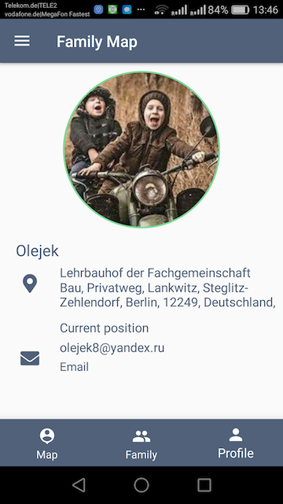
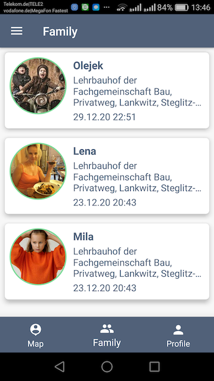
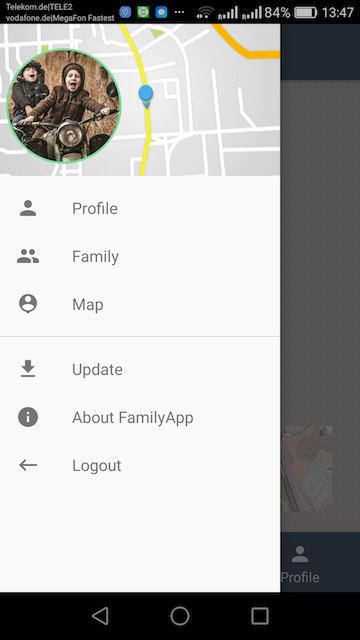
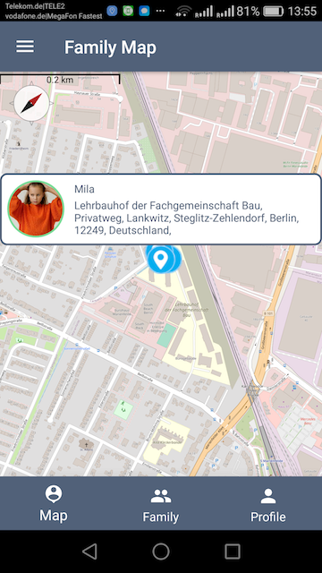

<h2>The Family Finder App</h2>

The Family Finder App is intended for displaying on the map the current position of family members or a certain, pre-formed group (also, routes / paths / distance / last position). App developed just for Android platform as Kotlin-test learning classe.
App consist from server side with API (present on different repository on my account) and this App. App implements MVP architecture using Dagger2, RealmDB, RxJava, FastAndroidNetworking and OSMDroid.
 
Some screenshots:
 

